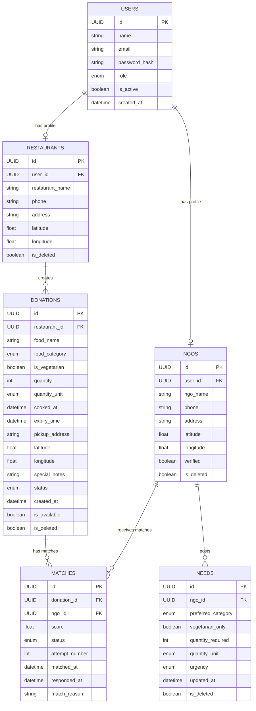

# AnnaSetu Database Structure

This document describes the database schema exactly as implemented in the current backend models and table creation logic.

## Quick Overview

The schema is centered around six main tables:

- users: the base account record for every person or organization.
- restaurants: profile data for restaurant users.
- ngos: profile data for NGO users.
- donations: food items offered by restaurants.
- needs: food requests posted by NGOs.
- matches: the link between a donation and an NGO during the matching process.

Key design characteristics:
- UUID primary keys are used throughout.
- Soft-delete flags are present on profile and transactional tables.
- Enums are used for role, category, unit, urgency, and status.
- The matching flow is modeled explicitly through the matches table.

---

## 1. Overall ER Diagram (Mermaid)

---

## 2. Table by Table Documentation

### users

Purpose: the base account record for every user in the system.

| Column | Type | Nullable | Default | Description |
|--------|------|----------|---------|-------------|
| id | UUID | No | uuid.uuid4 | UUID primary key. |
| name | String | No | None | User display name. |
| email | String | No | None | Unique email address. |
| password_hash | String | Yes | None | Stored password hash. |
| role | Enum(UserRole) | No | None | User role: RESTAURANT, NGO, or ADMIN. |
| is_active | Boolean | Yes | True | Whether the account is active. |
| created_at | DateTime(timezone=True) | Yes | server_default=func.now() | Timestamp of account creation. |

Important notes:
- UUID PK.
- Unique email constraint.
- Indexed on id and email.
- Acts as the parent record for either a restaurant profile or an NGO profile.

### restaurants

Purpose: stores the profile information for users who act as restaurants.

| Column | Type | Nullable | Default | Description |
|--------|------|----------|---------|-------------|
| id | UUID | No | uuid.uuid4 | UUID primary key. |
| user_id | UUID | No | None | Foreign key to users.id. |
| restaurant_name | String | No | None | Restaurant name. |
| phone | String | No | None | Contact phone number. |
| address | String | No | None | Physical address. |
| latitude | Float | Yes | None | Optional latitude. |
| longitude | Float | Yes | None | Optional longitude. |
| is_deleted | Boolean | No | False | Soft-delete flag. |

Important notes:
- UUID PK.
- FK to users.id.
- One restaurant profile is linked to one user.

### ngos

Purpose: stores the profile information for users who act as NGOs.

| Column | Type | Nullable | Default | Description |
|--------|------|----------|---------|-------------|
| id | UUID | No | uuid.uuid4 | UUID primary key. |
| user_id | UUID | No | None | Foreign key to users.id. |
| ngo_name | String | No | None | NGO name. |
| phone | String | No | None | Contact phone number. |
| address | String | No | None | Physical address. |
| latitude | Float | Yes | None | Optional latitude. |
| longitude | Float | Yes | None | Optional longitude. |
| verified | Boolean | Yes | False | Verification status. |
| is_deleted | Boolean | No | False | Soft-delete flag. |

Important notes:
- UUID PK.
- FK to users.id.
- One NGO profile is linked to one user.

### donations

Purpose: records food donations created by restaurants.

| Column | Type | Nullable | Default | Description |
|--------|------|----------|---------|-------------|
| id | UUID | No | uuid.uuid4 | UUID primary key. |
| restaurant_id | UUID | No | None | Foreign key to restaurants.id. |
| food_name | String | No | None | Name of the donated food item. |
| food_category | Enum(FoodCategory) | No | None | Category of the food. |
| is_vegetarian | Boolean | No | None | Whether the food is vegetarian. |
| quantity | Integer | No | None | Quantity amount. |
| quantity_unit | Enum(QuantityUnit) | No | None | Unit for the quantity. |
| cooked_at | DateTime | Yes | None | Timestamp when food was cooked. |
| expiry_time | DateTime | No | None | Expiration timestamp. |
| pickup_address | String | No | None | Pickup address. |
| latitude | Float | Yes | None | Optional pickup latitude. |
| longitude | Float | Yes | None | Optional pickup longitude. |
| special_notes | String | Yes | None | Extra notes for the donation. |
| status | Enum(DonationStatus) | Yes | CREATED | Current donation status. |
| created_at | DateTime(timezone=True) | Yes | server_default=func.now() | Creation timestamp. |
| is_available | Boolean | No | True | Availability flag. |
| is_deleted | Boolean | No | False | Soft-delete flag. |

Important notes:
- UUID PK.
- FK to restaurants.id.
- Uses enums for food category, quantity unit, and donation status.

### needs

Purpose: stores food requests posted by NGOs.

| Column | Type | Nullable | Default | Description |
|--------|------|----------|---------|-------------|
| id | UUID | No | uuid.uuid4 | UUID primary key. |
| ngo_id | UUID | No | None | Foreign key to ngos.id. |
| preferred_category | Enum(FoodCategory) | No | None | Preferred food category. |
| vegetarian_only | Boolean | Yes | False | Whether vegetarian-only food is preferred. |
| quantity_required | Integer | No | None | Quantity required. |
| quantity_unit | Enum(QuantityUnit) | No | None | Unit for required quantity. |
| urgency | Enum(Urgency) | Yes | MEDIUM | Urgency level. |
| updated_at | DateTime(timezone=True) | Yes | server_default=func.now() | Last update timestamp. |
| is_deleted | Boolean | No | False | Soft-delete flag. |

Important notes:
- UUID PK.
- FK to ngos.id.
- Uses enums for category, quantity unit, and urgency.

### matches

Purpose: stores match attempts between donations and NGOs.

| Column | Type | Nullable | Default | Description |
|--------|------|----------|---------|-------------|
| id | UUID | No | uuid.uuid4 | UUID primary key. |
| donation_id | UUID | No | None | Foreign key to donations.id. |
| ngo_id | UUID | No | None | Foreign key to ngos.id. |
| score | Float | Yes | None | Match score. |
| status | Enum(MatchStatus) | Yes | PENDING | Match status. |
| attempt_number | Integer | No | None | Attempt number for the matching flow. |
| matched_at | DateTime(timezone=True) | Yes | server_default=func.now() | Timestamp when the match record was created. |
| responded_at | DateTime | Yes | None | Timestamp when the match was responded to. |
| match_reason | String | Yes | None | Free-form reason for the match. |

Important notes:
- UUID PK.
- FKs to donations.id and ngos.id.
- Stores the association between a donation and a potential NGO recipient.

---

## 3. Relationships

### 1. User to Restaurant
- Type: One-to-One
- Implementation: restaurants.user_id -> users.id
- Meaning: one user can have one restaurant profile.

### 2. User to NGO
- Type: One-to-One
- Implementation: ngos.user_id -> users.id
- Meaning: one user can have one NGO profile.

### 3. Restaurant to Donation
- Type: One-to-Many
- Implementation: donations.restaurant_id -> restaurants.id
- Meaning: one restaurant can create many donations.

### 4. NGO to Need
- Type: One-to-Many
- Implementation: needs.ngo_id -> ngos.id
- Meaning: one NGO can post many needs.

### 5. NGO to Match
- Type: One-to-Many
- Implementation: matches.ngo_id -> ngos.id
- Meaning: one NGO can have many match records.

### 6. Donation to Match
- Type: One-to-Many
- Implementation: matches.donation_id -> donations.id
- Meaning: one donation can have many match records.

---

## 4. Entity Flow

### Restaurant flow
1. A user account is created.
2. A restaurant profile is attached to that user.
3. The restaurant creates one or more donation records.
4. Match records may be created for those donations.

### NGO flow
1. A user account is created.
2. An NGO profile is attached to that user.
3. The NGO posts one or more need records.
4. Match records may link those needs to available donations.

### End-to-end lifecycle
User -> Profile -> Donation/Need -> Match -> Action

---

## 5. Enums

### UserRole
Used by users.role.

- RESTAURANT
- NGO
- ADMIN

### FoodCategory
Used by donations.food_category and needs.preferred_category.

- MAIN_COURSE
- SNACKS
- DESSERT
- BEVERAGE
- BAKERY
- OTHER

### QuantityUnit
Used by donations.quantity_unit and needs.quantity_unit.

- MEALS
- PLATES
- KG
- LITERS
- PACKETS
- OTHER

### Urgency
Used by needs.urgency.

- LOW
- MEDIUM
- HIGH

### DonationStatus
Used by donations.status.

- CREATED
- MATCHING
- PENDING
- ACCEPTED
- PICKED_UP
- COMPLETED
- CANCELLED
- EXPIRED

### MatchStatus
Used by matches.status.

- PENDING
- ACCEPTED
- REJECTED
- TIMEOUT

---

## 6. Important Constraints

- users.email is unique and indexed.
- All primary keys are UUID values.
- Foreign keys are used for user-profile links and donation/need/match associations.
- Soft-delete fields exist on restaurants, ngos, donations, and needs.
- donations.is_available defaults to True.
- donations.status defaults to CREATED.
- needs.urgency defaults to MEDIUM.
- matches.status defaults to PENDING.
- created_at and updated_at timestamps are generated by the database layer.
- Several fields remain nullable because the model definitions do not force them to be non-nullable.

---

## 7. Observations

- The schema is reasonably normalized for the current phase because profile data and transactional data are separated into dedicated tables.
- The matching flow is explicit and easy to follow through the matches table.
- There is some repeated location and address information across restaurants, ngos, and donations.
- The design currently focuses on a simple matching workflow rather than a full account or audit system.
- Authentication-related tables such as sessions or password-reset records are not present yet.
- The schema appears to be a Phase 1 implementation with soft-delete support and simple role-based profiles.
